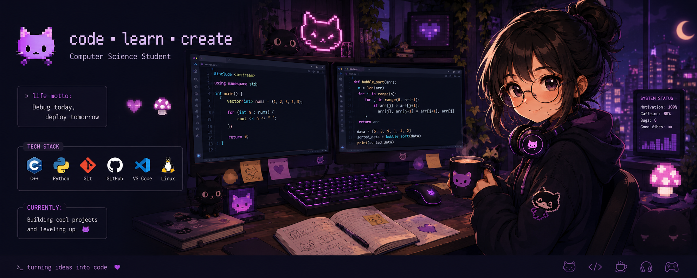

<p align="center">
  
</p>

## 👋 Hey there!

I'm Natalia, a Cognitive Scientist and Computer Science student who enjoys solving problems, exploring new ideas, and creating things that feel alive.

### 🌙 About Me

* 💻 Interested in software development
* 🧠 Working with EEG and cognitive research
* 🎮 Gamer at heart
* :cake: Powered by sweets

### 🎯 Current Quest

```text
[ ] Finish university projects
[ ] Learn something new
[ ] Keep GitHub organized
[x] Start another side project
```

### 📚 Currently Learning

* Game development
* Machine Learning
* Software Engineering
* Whatever caught my attention this week

### 📊 GitHub Stats

<p align="center">
  
  
</p>

### 🌸 Fun Fact

```cpp
while (alive)
{
    learn();
    code();
    playGames();
    // execution order may vary
}
```

Sometimes the bug is in the code.

Sometimes the bug is me.
